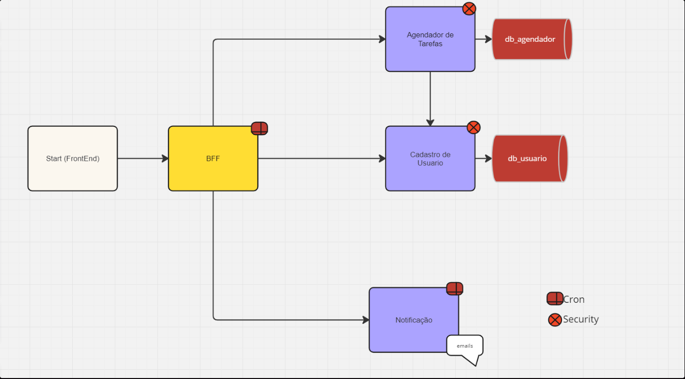

# Sistema Agendador de Tarefas

Sistema back-end desenvolvido em Java e Spring Boot para gerenciamento e agendamento de tarefas.

O projeto foi construído utilizando uma arquitetura baseada em microsserviços, separando as responsabilidades de usuários, tarefas, notificações e integração entre os serviços.

## Arquitetura

## Microsserviços

### Usuario

Responsável pelo cadastro de usuários, autenticação e geração de tokens JWT.

**Tecnologias:**
- Java
- Spring Boot
- Spring Security
- JWT
- Spring Data JPA
- PostgreSQL

Repositório:  
https://github.com/rayandealmeida/usuario

---

### Agendador de Tarefas

Responsável pelo cadastro, consulta, atualização e exclusão das tarefas dos usuários.

As tarefas são associadas ao usuário autenticado através das informações presentes no token JWT.

**Tecnologias:**
- Java
- Spring Boot
- Spring Security
- JWT
- Spring Data MongoDB
- MongoDB
- OpenFeign

Repositório:  
https://github.com/rayandealmeida/agendador-tarefas

---

### BFF Agendador de Tarefas

Responsável por centralizar o acesso aos serviços e realizar a comunicação entre os microsserviços.

Também possui uma rotina agendada que busca tarefas próximas do horário de execução e inicia o processo de notificação.

**Tecnologias:**
- Java
- Spring Boot
- Spring Cloud OpenFeign
- Spring Scheduling
- Swagger / OpenAPI

Repositório:  
https://github.com/rayandealmeida/bff-agendador-tarefas

---

### Notificacao

Serviço responsável pelo envio das notificações por e-mail.

Recebe os dados da tarefa e realiza o envio da mensagem para o usuário correspondente.

**Tecnologias:**
- Java
- Spring Boot
- Spring Mail
- SMTP

Repositório:  
https://github.com/rayandealmeida/notificacao

## Principais funcionalidades

- Cadastro e autenticação de usuários
- Autenticação utilizando JWT
- Cadastro de tarefas
- Consulta de tarefas por usuário
- Consulta de tarefas por período
- Atualização de tarefas
- Exclusão de tarefas
- Controle do status de notificação
- Comunicação entre microsserviços utilizando OpenFeign
- Busca automática de tarefas através de rotina agendada
- Envio de notificações por e-mail
- Documentação das APIs com Swagger

## Tecnologias utilizadas

- Java
- Spring Boot
- Spring Security
- Spring Data JPA
- Spring Data MongoDB
- Spring Cloud OpenFeign
- Spring Scheduling
- JWT
- PostgreSQL
- MongoDB
- Swagger / OpenAPI
- Gradle
- Maven

## Bancos de dados

O sistema utiliza bancos diferentes de acordo com a responsabilidade de cada serviço.

**PostgreSQL**

Utilizado pelo serviço de usuários para armazenamento dos dados de cadastro e autenticação.

**MongoDB**

Utilizado pelo serviço de tarefas para armazenamento das tarefas dos usuários.

## Segurança

A autenticação é realizada através de JWT.

Após o login, o serviço de usuários gera um token que é utilizado nas requisições protegidas e também encaminhado entre os serviços quando necessário.

Dessa forma, as tarefas podem ser associadas ao usuário autenticado sem que o e-mail precise ser informado manualmente em cada operação.

## Documentação da API

Os endpoints podem ser visualizados e testados através do Swagger nos serviços que disponibilizam API REST.

## Estrutura do projeto

Cada microsserviço possui seu próprio repositório e pode ser desenvolvido e executado de forma independente.
Essa separação permite que cada serviço tenha sua própria responsabilidade e tecnologia de persistência.

## Status

Versão inicial concluída.

O projeto continuará recebendo melhorias e novas funcionalidades conforme os estudos e evolução da arquitetura.
